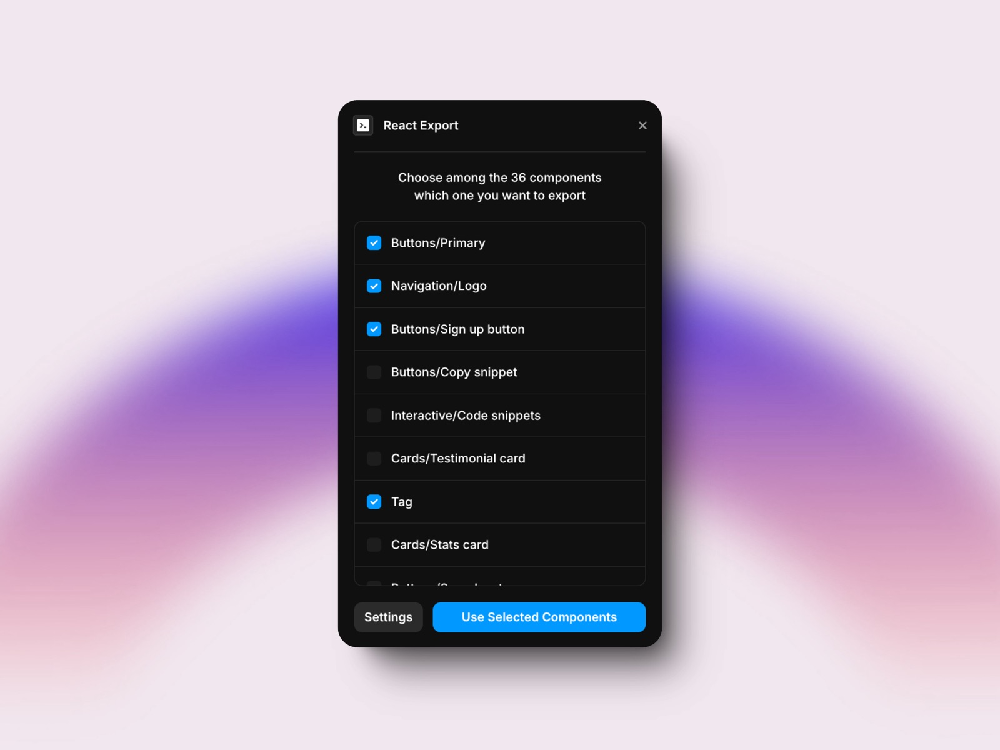

<div align='center'>
    <br/>
    <br/>
    <h3>unframer</h3>
    <br/>
    <br/>
</div>

Download framer components as simple files

-   Works with any React framework (Next.js, Remix, Vite, etc)
-   Includes all your components dependencies
-   Works with Framer locales, fetch, Framer Forms, color styles, dark mode (via `dark` class), etc
-   Has Typescript support, inferred from your component variables (like `variant`)

## Usage

1. Install the package

    ```sh
    npm install unframer
    ```

1. Install the [`React Export` Framer plugin](https://www.framer.com/marketplace/plugins/react-export/), open it and select which components you want to export.

<div align="center">
    
</div>

1. Run the command `npx unframer {projectId} --outDir ./src/framer` to download the components and their types in the `outDir` directory, the command will be shown in the Framer plugin too. Run this command each time you update your Framer project and want to update the components.

1. Import the component inside your `jsx` files together with the `styles.css` file, for example

```tsx
import './framer/styles.css' // load base Framer styles
import Menu from './framer/menus'

export default function App() {
    return (
        <div>
            <Menu componentVariable='some variable' />
        </div>
    )
}
```

## Using responsive variants

```tsx
import './framer/styles.css'
import Logos from './framer/logos'

export default function App() {
    return (
        <div>
            {/* Changes component variant based on breakpoint */}
            <Logos.Responsive
                variants={{
                    lg: 'Desktop Variant',
                    md: 'Tablet Variant',
                    base: 'Mobile Variant',
                }}
            />
        </div>
    )
}
```

## Styling

You can use `className` or `style` props to style your components

Notice that you will often need to use `!important` to override styles already defined in framer like `width` and `height`

```tsx
import './framer/styles.css'
import Logos from './framer/logos'

export default function App() {
    return (
        <div>
            {/* Changes component variant based on breakpoint */}
            <Logos.responsive
                className='!w-full'
                variants={{
                    lg: 'Desktop',
                    md: 'Tablet',
                    base: 'Mobile',
                }}
            />
        </div>
    )
}
```

## Sizing components

Framer components can have a fixed size, this comes from the root element in the Framer component editor. To override this size you will need to use the `style` prop or use a class with high specificity.

```tsx
import './framer/styles.css'
import Logos from './framer/logos'

export default function App() {
    return (
        <div>
            <Logos.responsive
                className='!w-full' // use !important to override framer default size
                style={{ width: '100%' }} // or use style prop, which has higher specificity than the Framer class
                variants={{
                    lg: 'Desktop',
                    md: 'Tablet',
                    base: 'Mobile',
                }}
            />
        </div>
    )
}
```

## Changing locale

You can change locale of your component by passing `locale` prop to the component. The locale must be one of the country codes configured in your Framer project.

```tsx
import './framer/styles.css'
import Logos from './framer/logos'

export default function App() {
    return (
        <div>
            <Logos locale='it-IT' />
        </div>
    )
}
```

## Dark Mode

Unframer supports dark mode through CSS classes:

1. Add the `dark` class to any parent element of your component
2. This will automatically switch all color style variables to use the dark mode values defined in Framer

That's all you need to enable dark mode for your Framer components!

> This is also how Tailwind's dark mode works - when you add the `dark` class to a parent element, any Tailwind dark mode classes (like `dark:bg-gray-900`) within that element will be activated. So you can seamlessly combine Framer and Tailwind dark mode by using the same `dark` class:

```tsx
import './framer/styles.css'
import Logos from './framer/logos'

export default function App() {
    return (
        <div className='dark'>
            <Logos />
        </div>
    )
}
```

## Watching for changes

You can use the `--watch` flag to automatically re-export components when they change in Framer: notice that you will need to click the Publish button in Framer to trigger the cli, Framer only updates the JavaScript modules when you publish your website.

<details>
<summary>How it works</summary>
Unframer cli will poll your website url every 2 seconds with a HEAD request, when the `etag` header changes it will re-export the components. This means that the --watch flag may not work if your components are not used in your main page of your Framer website.
</details>

## How does unframer cli work?

The Framer React Export plugin saves your Framer components JavaScript url in the Unframer database. When you run the Unframer cli the components urls are fetched and bundled with esbuild. The bundler will also resolve npm dependencies in your Framer overrides and code components using the latest version.

You can customize the npm dependencies versions using the `--external` flag and installing them manually with `npm install`.

Unframer will also create a `styles.css` file with the Framer global styles and the fonts used in your components.

To generate TypeScript types for your components Unframer runs your downloaded components with Node.js and extracts the TypeScript types from the component `propertyControls` field, which is used to populate the Framer right bar controls.

The Responsive component renders your components for each different breakpoint and only shows the current breakpoint via a CSS media query. The unused breakpoints are removed before hydration thanks to React [`useSyncExternalStore`](https://react.dev/reference/react/useSyncExternalStore).

## Troubleshooting

If you find any errors rendering your components:

-   Check you have the latest version of `unframer` installed
-   Try downloading new versions of the components by running again `npx unframer {projectId}`, Framer may already have fixed the problem.
-   Try disabling React strict mode, this can cause many issues in Framer components.
-   If the export fails because Esbuild cannot find an export from a package (like `No matching export in "/:https://esm.sh/zustand" for import "default"`) you can use the `--external` option to externalie npm packages used by Framer, then install them manually with the right version with `npm install`.
    Framer sometimes uses legacy versions of npm packages in their components, for example with Zustand which is usually still in version 3.x. This happens because Framer packages must be the same in the whole project and their versions are fixed at the time the npm package is used in a code component or override.

## Supported component props

`unframer` will add TypeScript definitions for your Framer components props and variables, some example variables you can use are:

-   `variant`, created when you use variants in Framer
-   functions, created when you use an `event` variable in Framer
-   Any scalar variable like String, Number, Boolean, Date, etc
-   Image variables (object with `src`, `srcSet` and `alt`), created when you use an `image` variable in Framer
-   Link strings, created when you make a link a variable in Framer
-   Rich text, created when you use a `richText` variable in Framer
-   Color, a string
-   React component, created when you use a `component` variable in Framer, for example in the Ticker component

## Known limitations:

-   You may face React warnings like:
    -   `Accessing element.ref was removed in React 19.` This warning appears because Framer still uses the old `element.ref` API which was removed in React 19. This warning is harmless and will be fixed when Framer updates their codebase to use the new React 19 APIs.
    -   `A tree hydrated but some attributes of the server rendered HTML didn't match the client properties.` This warning sometimes appears when using SWV icons, it should be harmless, it only happens in development mode.

## Future Compatibility

Every Framer runtime change is upstreamed automatically via Github Actions to this [file](unframer/src/framer.js) and an example app is deployed [here](https://unframer-nextjs-app.vercel.app/). This means that if something breaks it's easy to bisect the specific change and fix it.

For example in May 2024 Framer upgraded to React 19 and unframer broke, the reason was that framer runtime no longer injected ssr styles to `head` because react should do it automatically from version 19, this however broke unframer when using react 18, but i was able to quickly fix it by adding back the code to inject styles to `head` in unframer.

## Example

Look at the [nextjs-app source code folder](./nextjs-app) for an example and [the deployed website here](https://unframer-nextjs-app.vercel.app/)
