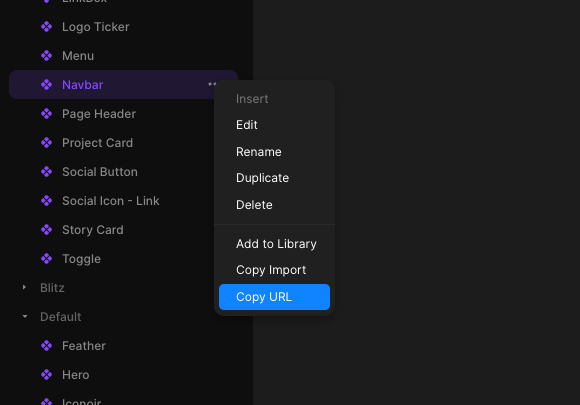

<div align='center'>
    <br/>
    <br/>
    <h3>installable-framer</h3>
    <br/>
    <br/>
</div>

> [!IMPORTANT]
> New Framer components no longer work, framer npm package is no longer updated and keeping a working fork has become too difficult.
> If you want to use Framer components contact Framer and tell them you are willing to pay to have this feature back, it's currently not prioritized because of low demand


install framer components as packages

-   Works with any React framework (Next.js, Gatsby, Vite, etc)
-   Includes all your components dependencies
-   Has Typescript support, inferred from your component variables (like `variant`)

## Usage

1. Install the package

    ```sh
    npm install installable-framer framer-motion
    ```

1. Create an `installable-framer.json` file like the following (the key will be used for the component folder inside `outDir`)

    ```json
    {
        "outDir": "./framer",
        "components": {
            "logos": "https://framer.com/m/Logo-Ticker-1CEq.js@YtVlixDzOkypVBs3Dpav",
            "menus": "https://framer.com/m/Mega-Menu-2wT3.js@W0zNsrcZ2WAwVuzt0BCl"
        }
    }
    ```

1. Copy your framer component url and add it to your config (remove the part after `@` to always use the latest version)

    

1. Run the command `npx installable-framer` to download the components and their types in the `outDir` directory
1. Import the component inside your `jsx` files, for example

```tsx
import Menu from './framer/menus'
import { FramerStyles } from 'installable-framer/dist/react'

export default function App() {
    return (
        <div>
            {/* Injects fonts and other framer utility styles */}
            <FramerStyles Components={[Menu]} />
            <Menu componentVariable='some variable' />
        </div>
    )
}
```

## Using responsive variants

```tsx
import Logos from './framer/logos'
import { FramerStyles } from 'installable-framer/dist/react'

export default function App() {
    return (
        <div>
            {/* Injects fonts and other framer utility styles */}
            <FramerStyles Components={[Logos]} />
            {/* Changes component variant based on breakpoint */}
            <Logos.Responsive
                variants={{
                    Desktop: 'Logo Ticker',
                    Tablet: 'Logo Ticker - M',
                    Mobile: 'Logo Ticker - M',
                }}
            />
        </div>
    )
}
```

## Styling

You can use `className` or `style` props to style your components

Notice that you will often need to use `!important` to override styles already defined in framer like `width` and `height`

```tsx
import Logos from './framer/logos'
import { FramerStyles } from 'installable-framer/dist/react'

export default function App() {
    return (
        <div>
            {/* Injects fonts and other framer utility styles */}
            <FramerStyles Components={[Logos]} />
            {/* Changes component variant based on breakpoint */}
            <Logos.responsive
                className='!w-full'
                variants={{
                    Desktop: 'Logo Ticker',
                    Tablet: 'Logo Ticker - M',
                    Mobile: 'Logo Ticker - M',
                }}
            />
        </div>
    )
}
```

## Supported component props

`installable-framer` will add TypeScript definitions for your Framer components props and variables, some example variables you can use are:

-   `variant`, created when you use variants in Framer
-   functions, created when you use an `event` variable in Framer
-   Any scalar variable like String, Number, Boolean, Date, etc
-   Image variables (object with `src`, `srcSet` and `alt`), created when you use an `image` variable in Framer
-   Link strings, created when you make a link a variable in Framer
-   Rich text, created when you use a `richText` variable in Framer
-   Color, a string
-   React component, created when you use a `component` variable in Framer, for example in the Ticker component

## Example

Look at the [nextjs-app](./nextjs-app) folder for an example
